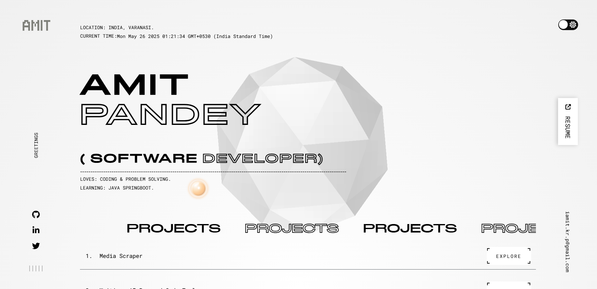
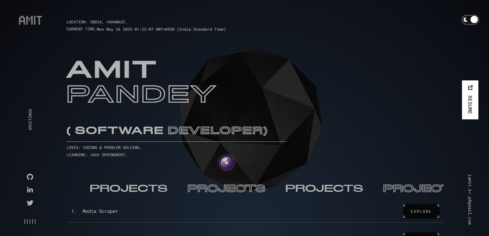

# My Portfolio Site

## Screenshots

### Light Mode


### Dark Mode


### Notes
- Favicon is `/favicon.png`. Remove unused `/favi.png` if unreferenced.

## Live
[Visit](https://my-site-three-dusky.vercel.app/)

## Setup
Download [Node.js](https://nodejs.org/en/download/).

Run this followed commands:

``` bash
# Install dependencies (only the first time)
npm install

# Run the local server
npm run dev

# Run the local server host
npm run host

# Build for production in the dist/ directory
npm run build
```
